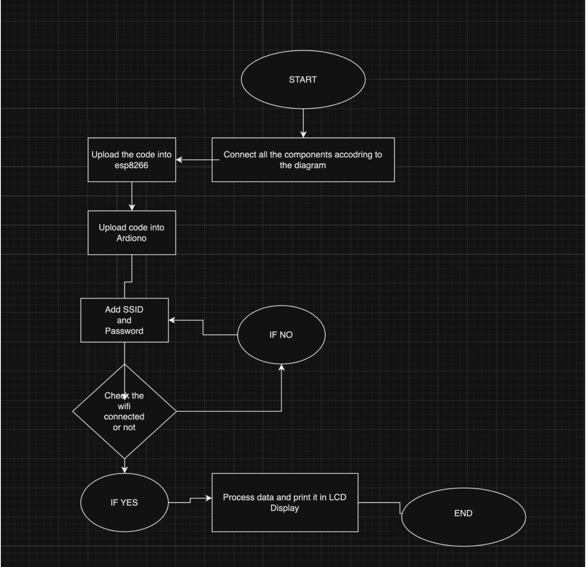
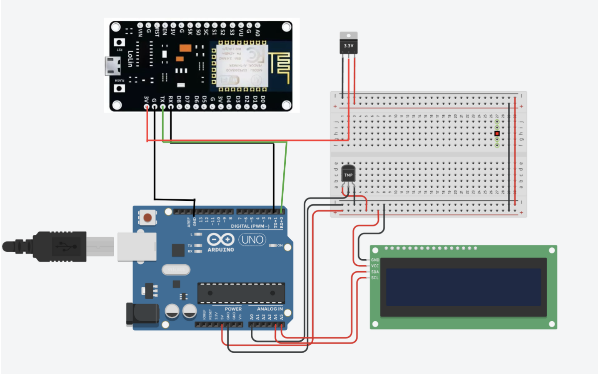
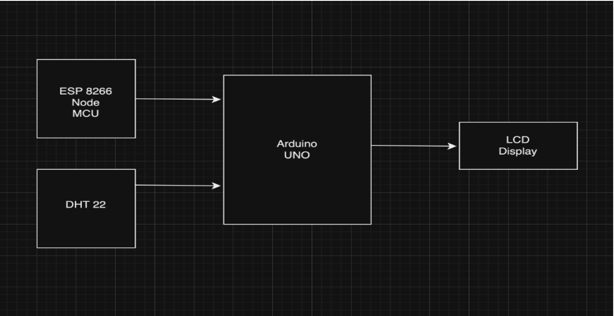
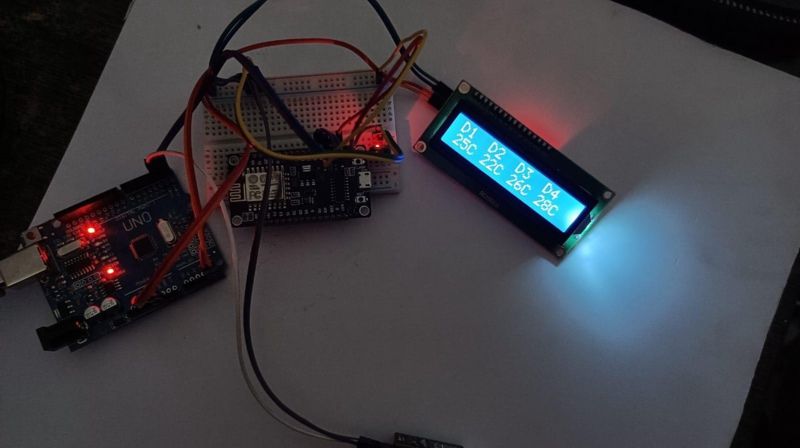
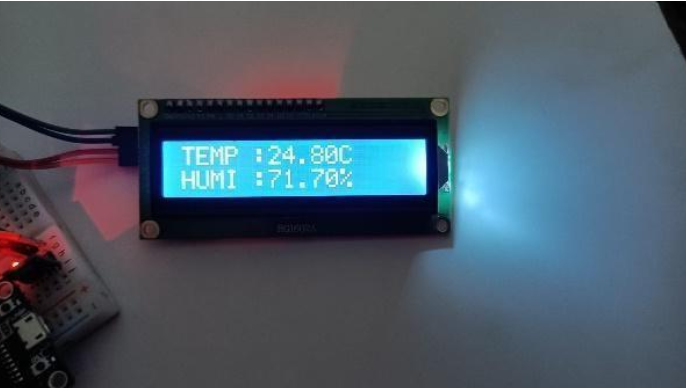

# IoT Weather Clock with Arduino and ESP8266 NodeMCU

Welcome to the IoT Weather Clock project, a simple and beginner-friendly implementation that combines Arduino, ESP8266 NodeMCU, and various sensors to create a smart clock displaying live time, date, room temperature, humidity, and real-time weather data.

## Overview

- 🕰️ **Live Time and Date Display:** ESP8266 NodeMCU ensures accurate timekeeping through a Wi-Fi connection.
- 🌡️ **Room Temperature and Humidity Monitoring:** DHT22 sensor provides real-time environmental insights.
- 🌍 **Real-Time Weather Data Integration:** OpenWeather API fetches up-to-the-minute weather updates.
- 🔧 **Efficient Data Processing:** ESP8266 communicates with Arduino to process and display information on the LCD.

## Table of Contents

- [Build Your Own](#build-your-own)
- [Project Structure](#project-structure)

## Build Your Own

To build your IoT Weather Clock, follow these steps:

1. **Clone the Repository:**
   ```bash
   git clone https://github.com/ajf1016/IOT-Weather-clock.git

2. **Project Structure:**
  - Arduino code for processing room temperature and humidity.
  - ESP8266 NodeMCU code for fetching and sending weather data.
  - Documentation, including circuit diagrams.







